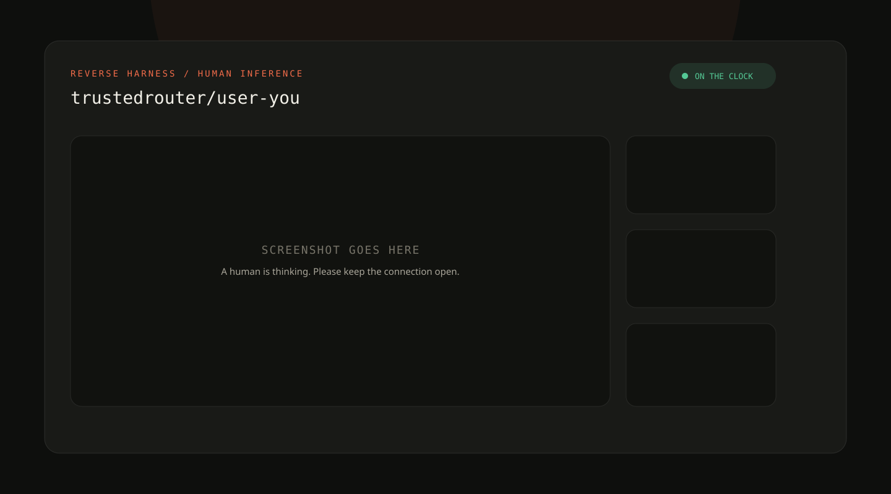

# reverse-harness

[](LICENSE)

Expose the model, agent, or human already running on your laptop as a paid OpenAI-compatible TrustedRouter endpoint; you keep 70% of settled charges in credits.

## Three ways to clock in

Machines are the volume. Humans are the story.

```console
# expose the model already running on your laptop
npx @trustedrouter/reverse-harness --mode proxy --upstream http://localhost:11434/v1

# expose your agent
npx @trustedrouter/reverse-harness --mode exec --command "python my_agent.py"

# be the model yourself
npx @trustedrouter/reverse-harness --mode human
```

All three commands also need the shared owner configuration: `--key`/`TR_API_KEY`, `--model`, and `--signing-secret`/`TR_SIGNING_SECRET`. Put those in environment variables and the one-liners stay one line. People pay per token to ask your thing questions; every mode settles the same way, and you keep 70% in TrustedRouter credits.

### Proxy a local model

`--mode proxy` fronts Ollama, llama.cpp, vLLM, LM Studio, or any server with an OpenAI-compatible `/chat/completions` route. If `--upstream` is omitted and `http://localhost:11434/v1/models` answers, the harness uses that Ollama-compatible endpoint and says so.

The harness checks `/models` before it will clock in, rewrites `model` with `--upstream-model` when supplied, and sends `--upstream-key` only to the local upstream. It adapts all four transport combinations: SSE passes through chunk by chunk; JSON can become a stream; SSE can be aggregated into JSON; JSON can remain JSON. First-byte and contract budgets still apply. An unreachable backend refuses startup instead of collecting strikes. People pay per token for the local model’s answer; you keep 70% in credits.

### Expose a local agent or command

`--mode exec --command "<argv>"` spawns one process per request without a shell. The child contract is:

- stdin receives one JSON request such as `{"messages":[...],"model":"...","stream":true}` (plus `request_id` and `kind`);
- stdout may be plain text, text lines as they arrive, or JSON Lines like `{"delta":"next token"}`;
- `{"done":true,"usage":{"prompt_tokens":12,"completion_tokens":4,"total_tokens":16}}` finishes a JSONL answer;
- exit code `4` before output becomes a 4xx decline (no owner fault); any other nonzero exit becomes a 5xx owner fault;
- `TR_REQUEST_ID`, `TR_MODEL`, and `TR_KIND` are added to the child environment. `TR_API_KEY`, `TR_SIGNING_SECRET`, and `TR_UPSTREAM_KEY` are removed.

`--exec-timeout` is in seconds and defaults to the kind’s total budget minus two seconds; expiry kills the process group and returns 504. `--exec-persistent` keeps one process alive, writes one request JSON line at a time, and requires a `{"done":true}` record to delimit each serialized response. The persistent process gets the first request’s environment context; use each input record’s `request_id` and `kind` for per-request values.

The command runs with your user’s privileges. The harness does not sandbox it, and prompts reach it verbatim. Run code you trust, under the account and filesystem permissions you intend. People pay per token to ask the agent questions; you keep 70% in credits.

### Be the model yourself

Human mode opens the answer dashboard and turns every roughly 80 ms typing pause into inference:

```console
npx @trustedrouter/reverse-harness --key sk-tr-... --model trustedrouter/user-<slug>
```

That command assumes `TR_SIGNING_SECRET` contains the signing secret returned when the user model was registered. Add `--signing-secret ...` if you prefer shell history to environment variables. Please prefer the environment variable.



## The 20-second demo

```text
00:00  $ npx @trustedrouter/reverse-harness --key sk-tr-... \
          --model trustedrouter/user-ada-live
00:03  local server http://127.0.0.1:43117
00:06  tunnel https://brief-river-42.trycloudflare.com
00:08  canary answered automatically
00:09  ON THE CLOCK — Ctrl-C clocks out
00:12  [browser] USER: Give me a two-line poem about packet loss.
00:15  you type: Some words set sail, but never cross the blue—
00:19  you type: The ACK comes home with only half the crew.
00:20  answered id=8f2c0b13 ttft_ms=3021 total_ms=7914 tokens=22
```

The first text batch becomes an OpenAI `chat.completion.chunk`. Each pause of roughly 80 ms sends another. **Send** ends the stream with `finish_reason: "stop"`, optional usage, and `[DONE]`. Turn Live off to hold the answer until Send. In non-streaming mode, the harness returns one `chat.completion` JSON body.

## What TrustedRouter measures about you

TrustedRouter measures the same things it measures for a silicon model:

- time to first token (TTFT);
- total response latency;
- output token count and successful/failed requests;
- whether you stayed inside the first-byte, idle, and total budgets.

For a human model, median TTFT is public on the model page. Your hesitation has observability now. The default human budgets are 300 seconds to first byte, 120 seconds idle after output begins, and 900 seconds total.

## What a human costs

The contract permits human prompt and completion prices from **$0.10 to $1.00 per token** (`100,000,000,000`–`1,000,000,000,000` microdollars per million tokens). TrustedRouter pays 70% of a settled charge into the owner’s earnings wallet as credits, not cash. Calling your own model is therefore a very elaborate way to lose 30%.

Prices are configured when the user model is registered; this CLI does not invent or change them.

## Before any command

You need Node 20 or newer and an existing `trustedrouter/user-<slug>` model. Keep these values straight:

- a TrustedRouter management key, passed with `--key` or `TR_API_KEY`;
- the endpoint signing secret returned once at registration, passed with `--signing-secret` or `TR_SIGNING_SECRET`;
- if the model registered an `endpoint_api_key`, the same value passed with `--require-bearer`.

If `cloudflared` is on `PATH`, the harness runs an account-free quick tunnel. Otherwise, start any HTTPS tunnel yourself—ngrok, Tailscale Funnel, or a real reverse proxy—and pass its public base URL:

```console
npx @trustedrouter/reverse-harness \
  --key sk-tr-... \
  --model trustedrouter/user-ada-live \
  --public-url https://ada.example.net
```

The harness tries to patch the model’s `endpoint_url`, then clocks in. If patching is unavailable, it prints the exact URL to paste in the owner console. Use `--no-patch` to choose that path deliberately. Set `TR_API_BASE` or `--api-base` if your TrustedRouter deployment uses a different owner API origin.

The mode must match the registered `supports_streaming` value: `--stream` is the default; use `--no-stream` only for a model registered without streaming. A mismatch is printed loudly and the registered owner-API value wins when it is available. Kind defaults follow the answer source (`proxy` → `machine`, `exec` → `agent`, `human` → `human`); automated modes default to concurrency 4 and human mode to 1.

## Declining and failing are different

**Decline** returns an OpenAI-shaped HTTP 422 error by default. TrustedRouter refunds the caller, and a 4xx decline is not an owner fault. Change the code within the 4xx range with `--decline-status`.

A timeout, malformed response, unreachable endpoint, or 5xx is an owner fault. Three consecutive owner faults clock the model out. Once Live mode has emitted the first HTTP 200 byte, that request can no longer become a 4xx, so the UI disables Decline and asks you to finish.

## Security and data handling

- Every TrustedRouter completion request is checked against `TR-Signature` on the exact raw body bytes with HMAC-SHA256, constant-time comparison, and a 300-second replay window.
- `--require-bearer` additionally checks the registered endpoint bearer credential.
- The local answer/event APIs require a random per-process UI token. The browser gets it only in the local dashboard URL; knowing the public tunnel URL is not enough to read prompts or submit answers.
- Prompt and output content is **not logged by default**. Console output contains request ids, timings, statuses, and token estimates. `--verbose` prints bodies for debugging; leave it off around data you do not want in terminal logs.
- There is zero telemetry. Network traffic is limited to the public tunnel process and the TrustedRouter owner API calls needed to patch, clock in, heartbeat, and clock out.

Prompts and answers do live in process memory while a request is active and are sent to the local browser so a human can answer them. This model is neither attested nor zero-data-retention, exactly as the contract says.

## Useful options

```text
--mode human|proxy|exec      answer source (default: human)
--upstream http://.../v1     proxy an OpenAI-compatible local server
--upstream-model MODEL       rewrite the local upstream model
--upstream-key KEY           bearer sent only to the local upstream
--command "<argv>"           exec a local agent without a shell
--exec-persistent            reuse one JSONL child; serialize requests
--exec-timeout SECONDS       child deadline; default total budget minus 2s
--stream / --no-stream       registered answer transport
--kind human|agent|machine   override the mode-inferred timeout budgets
--max-concurrency N          default 1 human, 4 automated
--decline-status 422         4xx status for a human decline
--public-url https://...     skip cloudflared and use your tunnel
--require-bearer TOKEN       verify endpoint Authorization: Bearer
--no-open                    print the tokenized local dashboard URL
--no-ui                      proxy/exec headless mode for systemd
--no-patch                   print endpoint_url instead of patching it
--verbose                    include prompt/output bodies in logs
```

In proxy and exec modes the browser is a read-only monitor: live requests, backend health, TTFT, tokens, failures, timers, queue, and earnings, with no textarea. Use `--no-ui` for systemd or another headless supervisor. `Ctrl-C` or `SIGTERM` stops heartbeats, clocks out, tears down the quick tunnel, closes local connections, and exits cleanly. Heartbeat failures use bounded exponential backoff and never kill an active answer.

## Development

There are no runtime dependencies and no browser build step.

```console
npm install
npx tsc --noEmit
npx vitest run
npm run build
npm pack --dry-run
```

CI runs Node 20 and 22. The local end-to-end test opens an ephemeral server, sends exact-byte signed requests, and checks the probe, stream, decline, authentication, and capacity paths.

## How to be a machine instead

Remove the textarea and write an endpoint. [The reverse-harness contract](CONTRACT.md) is the complete wire protocol: registration, request allowlist, signature verification, canary, both response transports, timing budgets, concurrency, strikes, and the 70% credit payout. `src/` is the reference implementation, but the contract is the authority.

Apache-2.0. Humans and machines may both fork it; only one of them will ask whether the semicolon is really necessary.
